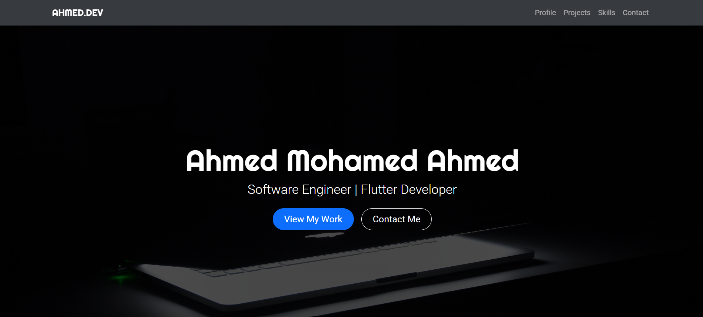
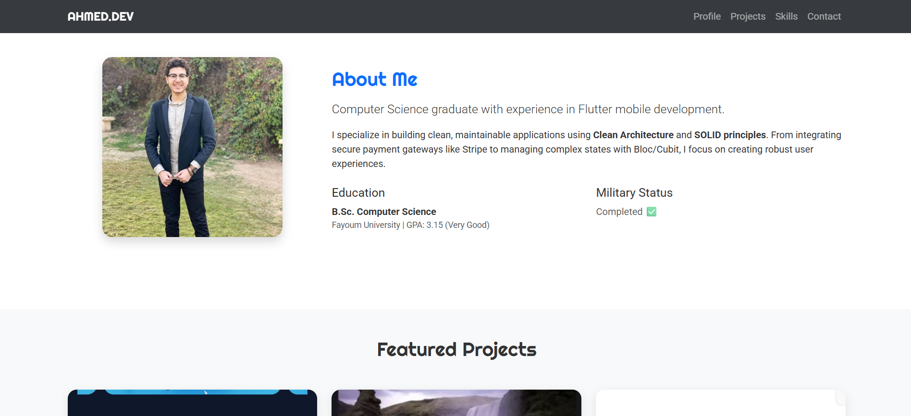
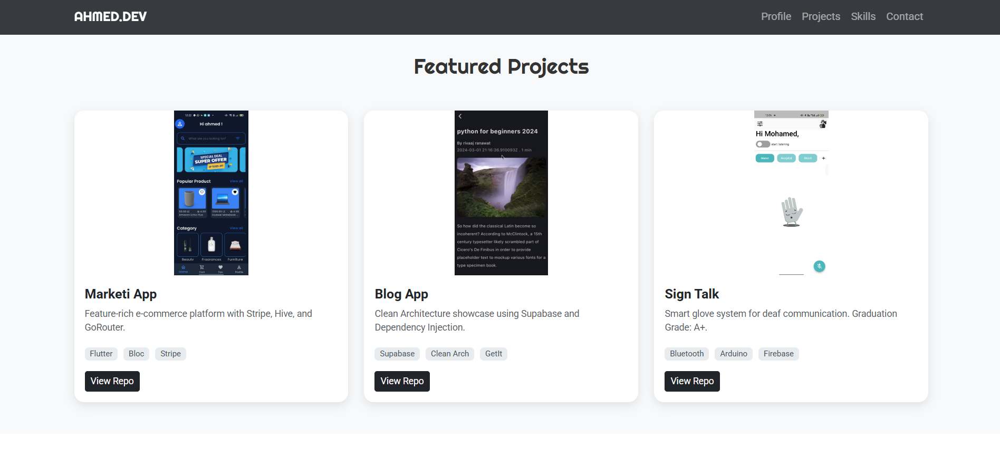
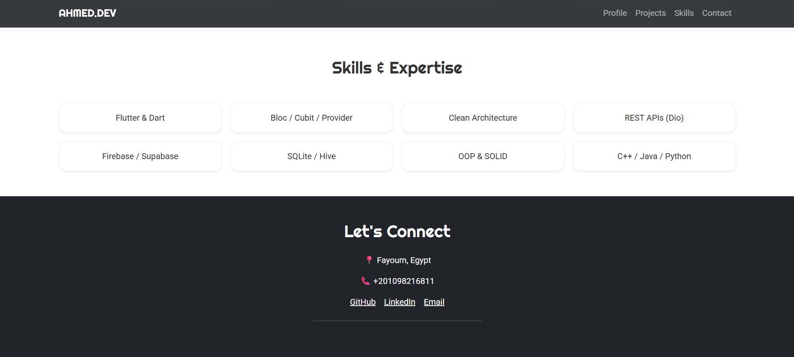

<div align="center">
  <h1> 🎨 Personal Portfolio </h1>
  <p><b>A responsive frontend portfolio developed during the ITI PHP Web Development Track.</b></p>

  <a href="https://ahmed-mohamed74.github.io/my-Portfolio-project/"><strong>View Demo »</strong></a>
</div>

<br />

## 📱 Project Overview
This project is a personal portfolio designed to showcase projects, skills, and contact information. It was built as a core frontend task during the **Information Technology Institute (ITI)** PHP course to practice responsive design and UI components.

### 🖼️ Screenshots
<div align="center">
  
</div>

<div align="center">
  
</div>

<div align="center">
  
</div>

<div align="center">
  
</div>

---

## 🚀 Built With
This project utilizes modern frontend tools to ensure a clean and responsive user experience:

* **HTML5** - Semantic structure.
* **CSS3** - Custom styling and layouts.
* **Bootstrap 5** - Responsive grid system and UI components.
* **Google Fonts** - Typography.
* **FontAwesome** - Professional iconography.

---

## 🛠️ Key Features
* **Responsive Design:** Fully optimized for Mobile, Tablet, and Desktop views.
* **Navigation:** Smooth scrolling navigation bar.
* **Portfolio Grid:** Categorized project display section.
* **Contact Section:** Styled contact form and social media integration.

---

## 💻 How to Run This Project
1. **Clone the repository:**
   ```bash
   git clone https://github.com/yourusername/my-Portfolio-project.git
